# 2 타원곡선
유한체와 타원곡선을 이용해 다음장에서 타원곡선 암호 생성

## 2.1 정의
타원 곡선 식은 다음과 같음
<pre>
y<sup>2</sup> = x<sup>3</sup> + ax + b
</pre>
  
  
1차 방정식은 다음과 같음
<pre>
y = mx + b
</pre>
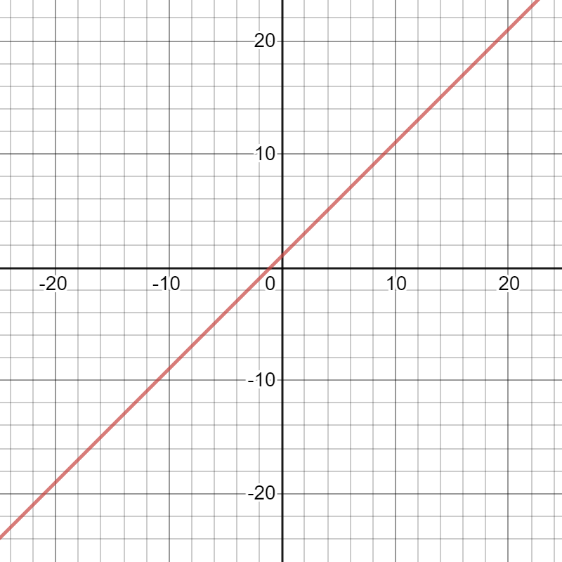    
###### [그림 2-1] 1차방정식 그래프    
  
  
2차 방정식은 다음과 같음
<pre>
y = ax<sup>2</sup> + bx + c
</pre>
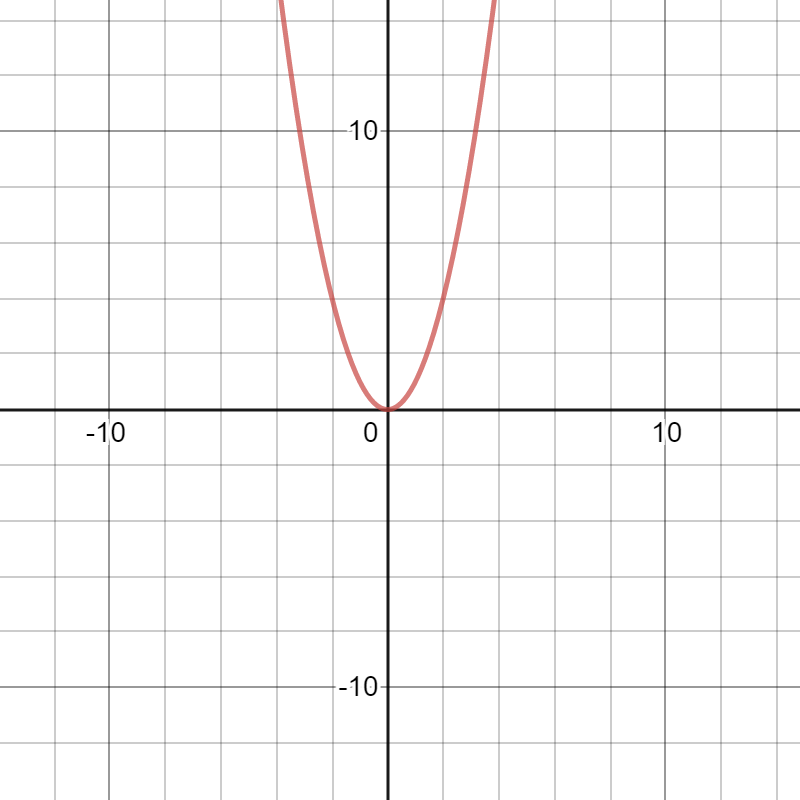    
###### [그림 2-2] 2차방정식 그래프    


3차 방정식은 다음과 같음
<pre>
y = ax<sup>3</sup> + bx<sup>2</sup> + cx + d
</pre>
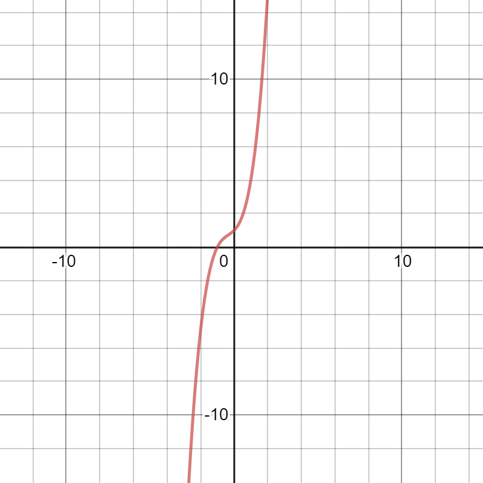    
###### [그림 2-3] 3차방정식 그래프    


타원곡선은 다음과 같음
<pre>
y<sup>2</sup> = x<sup>3</sup> + ax + b
</pre>
3차방정식의 곡선과 차이는 y<sup>2</sup> 이며, y<sup>2</sup>로 인해 그래프가 x축 대칭이 됨    
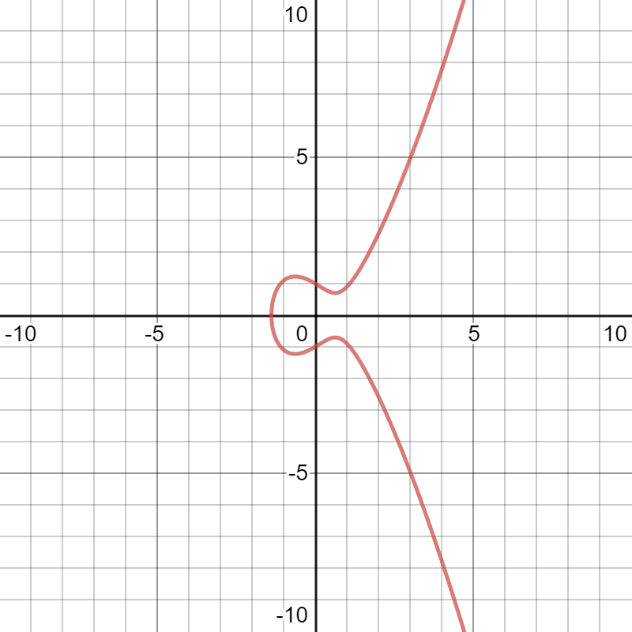    
###### [그림 2-4] 연속 타원곡선


3차곡선보다 기울기가 완만한데 이 또한 y<sup>2</sup> 때문임   
계숫값에 따라 곡선이 하나로 이어지지 않고 분리되기도 함    
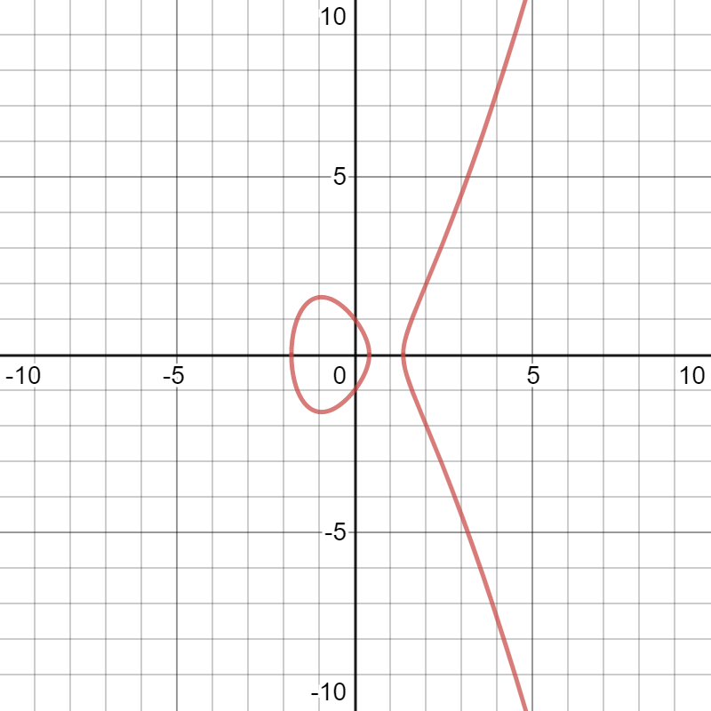    
###### [그림 2-5] 분리된 타원곡선


타원곡선은 3차방정식 그래프에서 y > 0인 부분을 완만하게 만들고, y > 0인 부분을 x축 대칭이 되도록 만든 그래프로 볼 수 있음    
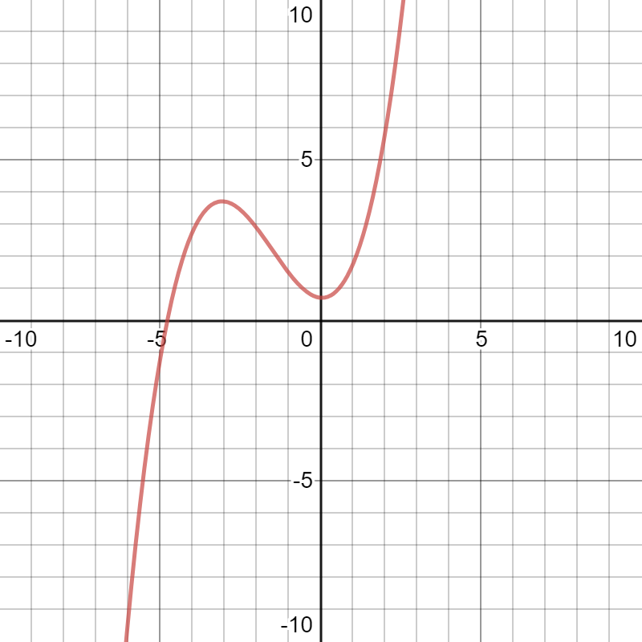    
###### [그림 2-6] 3차방정식 그래프 - 1단계


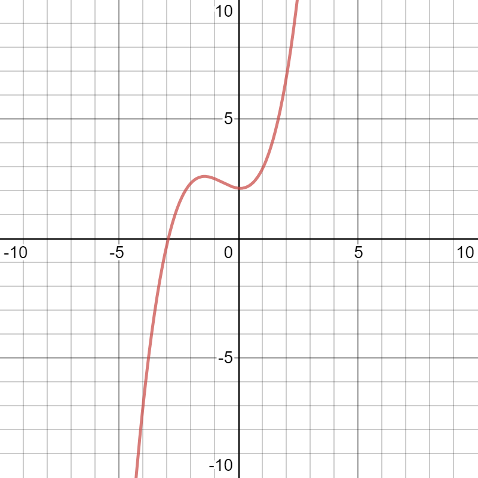    
###### [그림 2-7] 곡선이 완만한 3차방정식 그래프 - 2단계    
    
    
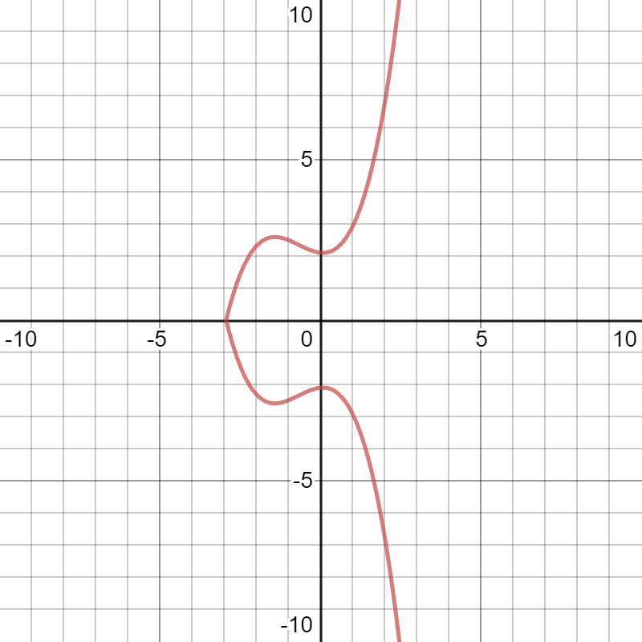    
###### [그림 2-8] y>0인 부분으로 x축 대칭인 그래프 - 3단계    
    
    
비트코인에 사용되는 타원곡선은 secp256k1이라고 하며 다음과 같음
<pre>
y<sup>2</sup> = x<sup>3</sup> + 7
</pre>
일반 정규식은 y<sup>2</sup> = x<sup>3</sup> + ax + b이며, 계숫값 a = 0, b = 7인 곡선으로 정의됨    
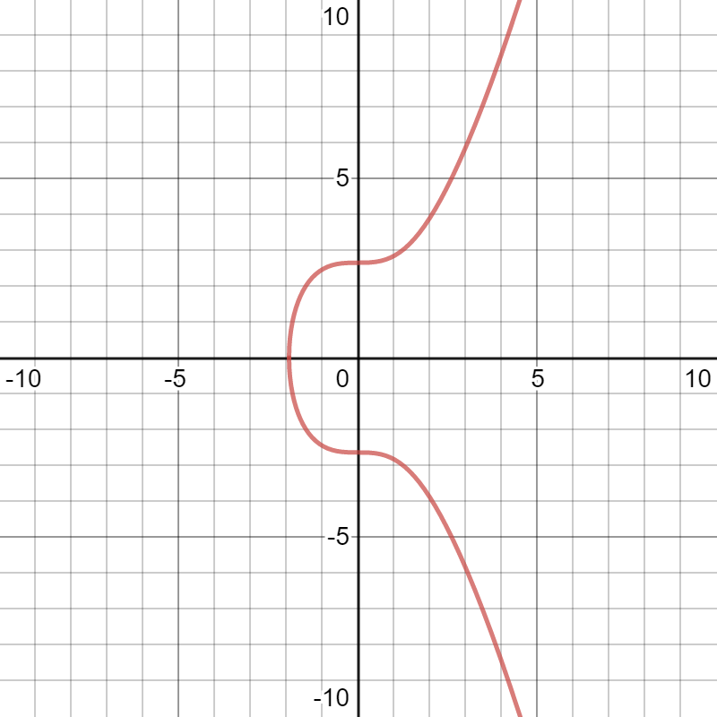    
###### [그림 2-9] secp256k1 곡선    
    
    
## 2.2 파이썬으로 타원곡선 코딩
곡선 자체보다 곡선 위 개별 점들에 의미가 있음    
예를 들어, y<sup>2</sup> = x<sup>3</sup> + 5x + 7곡선에서 (x, y) = (-1, 1)인 점이 중요함    
따라서, 특정 곡선의 한 점<sup>point</sup>으로 Point 클래스를 정의함    
곡선의 일반식은 y<sup>2</sup> = x<sup>3</sup> + ax + b로 a와 b 두 계숫값으로 곡선을 특정할 수 있음    

```
class Point:

    def __inint__(self, x, y, a, b):
        self.a = a
        self.b = b
        self.x = x
        self.y = y
        if self.y**2 != self.x**3 + a * x + b: ➊
            raise ValueError('({}, {}) is not on the curve'.format(x, y))
    
    def __eq__(self, other): ➋
        return self.x == other.x and self.y == other.y \
            and self.a == other.a. and self.b == other.b
```
> ➊ 주어진 점이 곡선 위에 있는지 검사    
> ➋ 두 점은 같은 곡선 위에 있고 그 좌푯값이 동일해야만 같다고 판정

## 2.3 두 점의 덧셈
타원곡선은 두 점의 덧셈(점 덧셈)을 정의하는 데 유용함    
점 덧셈은 곡선 위의 두 점에 대해 어떤 연산을 거쳐 곡선에 존재하는 제 3의 점을 얻는 과정    
일반적인 덧셈 연산과 같이 교환법칙이 성립함    
예를 들어, 점 A에 점 B를 더하는 것은 점 B를 점 A에 더하는 것과 같음

모든 타원곡선에 대해 특정 경우를 제외하고 곡선과 함께 그려진 직선은 반드시 곡선과 한 점 또는 세 점에서 만남    
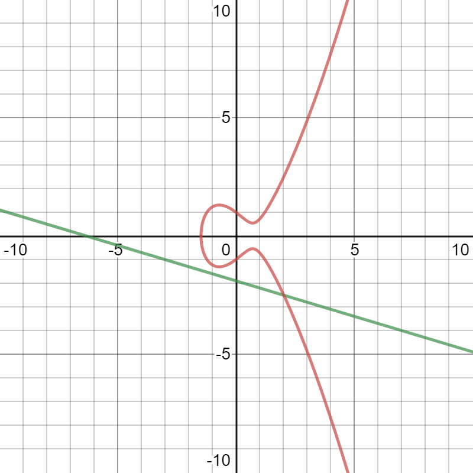    
###### [그림 2-10] 곡선과 한 점에서 만나는 직선    
    
    
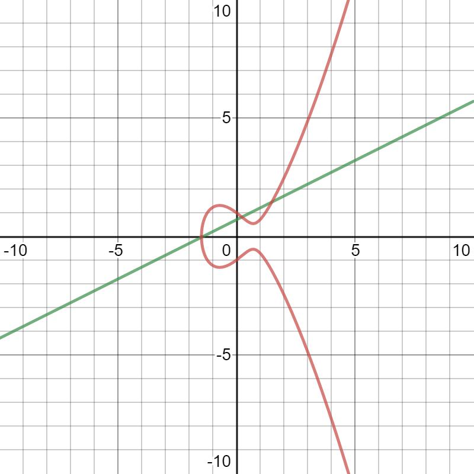    
###### [그림 2-11] 곡선과 세 점에서 만나는 직선    
    
    
직선이 y축과 평행하거나 곡선의 한 점에 접하여 두 점에서 만나는 경우도 존재함
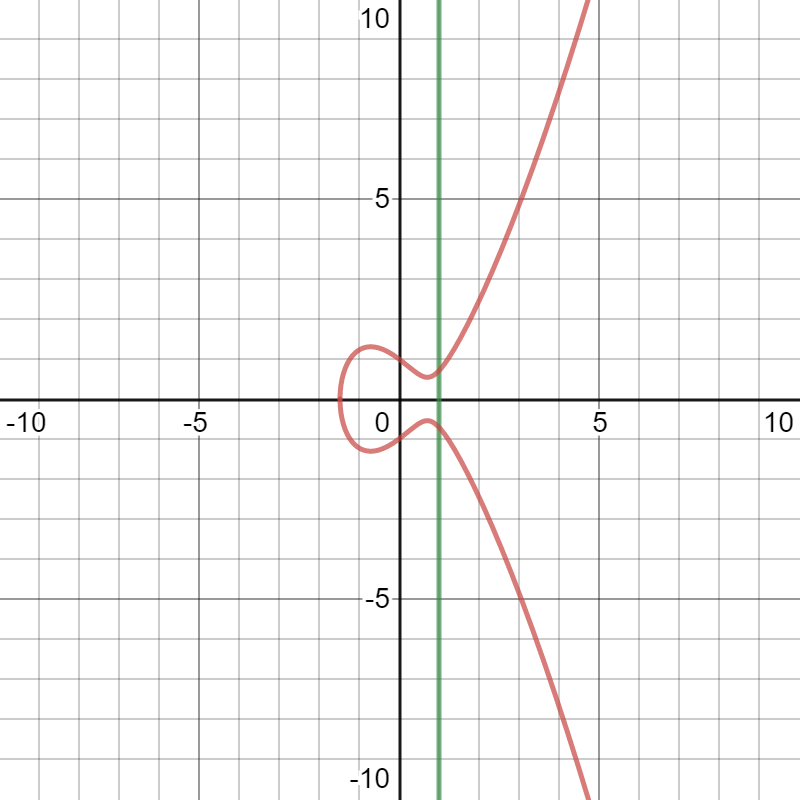    
###### [그림 2-12] 곡선과 두 점에서 만나는 y축과 평행한 직선     
    
    
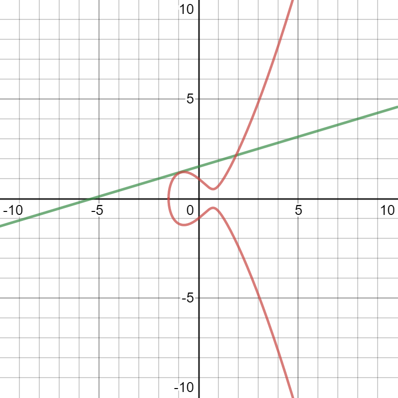    
###### [그림 2-13] 곡선과 두 점에서 만나는 곡선의 접선인 직선    
    
    
타원곡선에서 점 덧셈은 다음과 같이 정의함
<pre>
두 점 A와 B를 지나는 직선이 타원과 만나는 교점을 x축으로 대칭시킨 점을 A+B로 정의
직선이 타원곡선과 한 점에서 만나는 경우는 덧셈 정의 불가
</pre>
타원곡선 위의 두 점 A, B에 대해 A+B를 구하는 과정은 다음과 같음
    1. 두 점 a와 b를 지나가는 직선이 타원곡선과 새롭게 만나는 점 c 탐색
    2. 그 점과 X축에 대해 대칭인 점이 점 덧셈 결과인 A+B가 됨
    
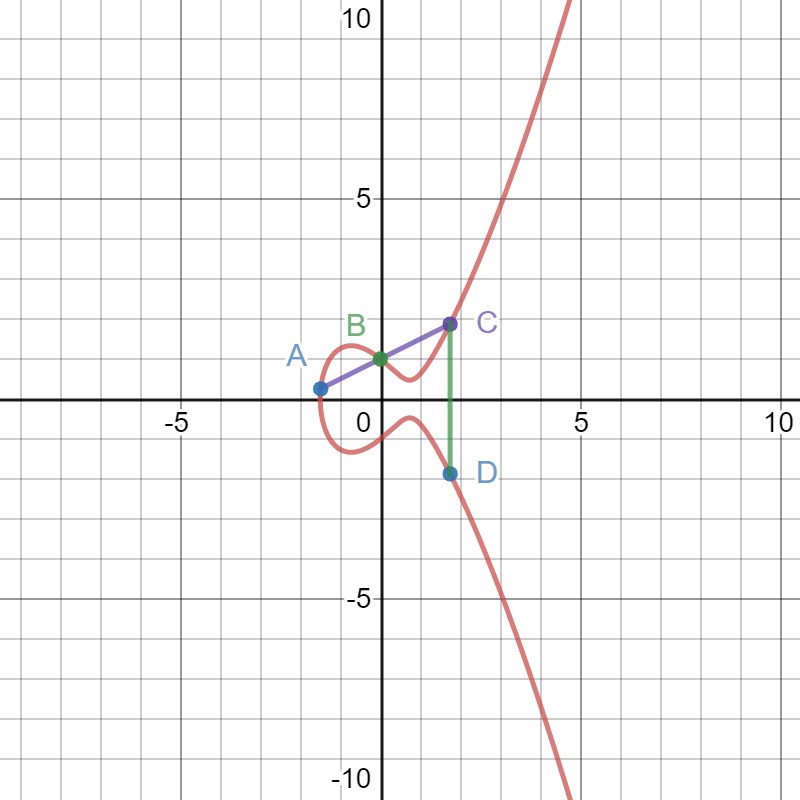    
###### [그림 2-14] 두 점의 덧셈    
     
     
점 덧셈의 결과는 직관적으로 예측하기 어렵다는 성질을 가짐    
점 덧셈은 비선형<sup>nonlinear</sup> 연산이라고 함    

## 2.4 점 덧셈 성질
점 덧셈은 일반 덧셈 연산과 유사한 몇 가지 성질을 만족함
* 항등원 존재
* 교환법칙 성립
* 결합법칙 성립
* 역원 존재
    
항등원<sup>identity</sup>는 대수의 0과 같은 의미의 점이 존재함을 의미    
즉, 곡선 위의 점 I와 A라는 점의 덧셈 결과는 A임
<pre>
    I + A = A
</pre>
점 I를 무한원점<sup>point at infinity</sup>라고 부름    
    
무한원점은 덧셈에 대한 역원<sup>invertibility</sup>와 관련이 있음    
어떤 점 A에 대해 점 -A가 존재한다면, 두 점의 합은 항등원이 됨
<pre>
    A + (-A) = I
</pre>
이 점들은 x축에 수직인 직선과 곡선의 교점들임
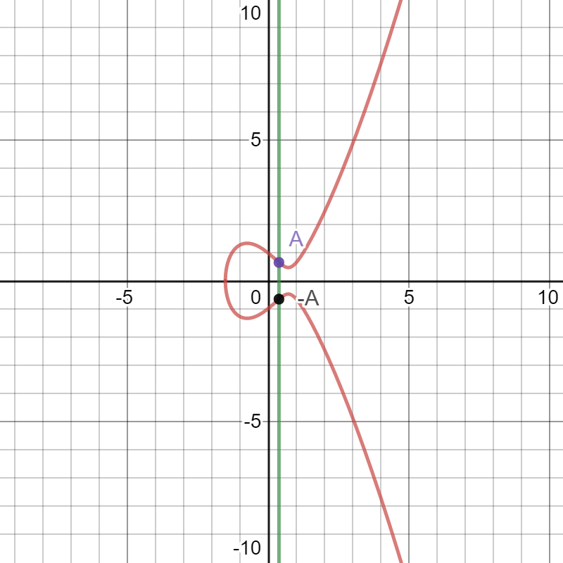
###### [그림 2-15] x축에 수직인 직선과 곡선의 교점
    
x축에 수직인 직선과 타원곡선이 만나는 세 번째 점은 영원이 만나지 않으므로, 무한대에 있다고 볼 수 있음  

교환법칙은 연산 순서를 바꿔도 결과가 같음을 의미함  
<pre>
    A+B=B+A
</pre>

결합법칙은 3개 이상의 덧셈에서 어느 두 항을 먼저 더해도 결과가 동릴함을 의미함
<pre>
    (A+B)+C=A+(B+C)
</pre>
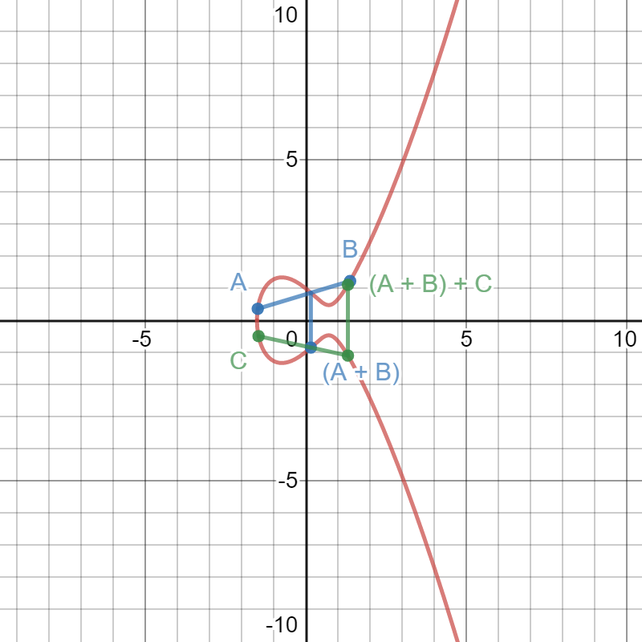  
###### [그림 2-16] (A + B) + C

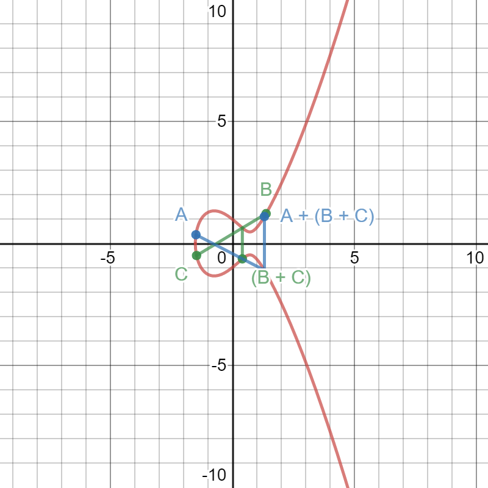
###### [그림 2-17] A + (B + C)

## 점 덧셈 코딩하기
점 덧셈을 코딩하기 위해 더하는 두 점은 다음 세 가지 경우로 나눌 수 있음  
    1. 두 점이 x축에 수직인 직선 위에 있는 경우
    2. 두 점이 x축에 수직인 직선 위에 있지 않은 경우
    3. 두 점이 같은 경우 
